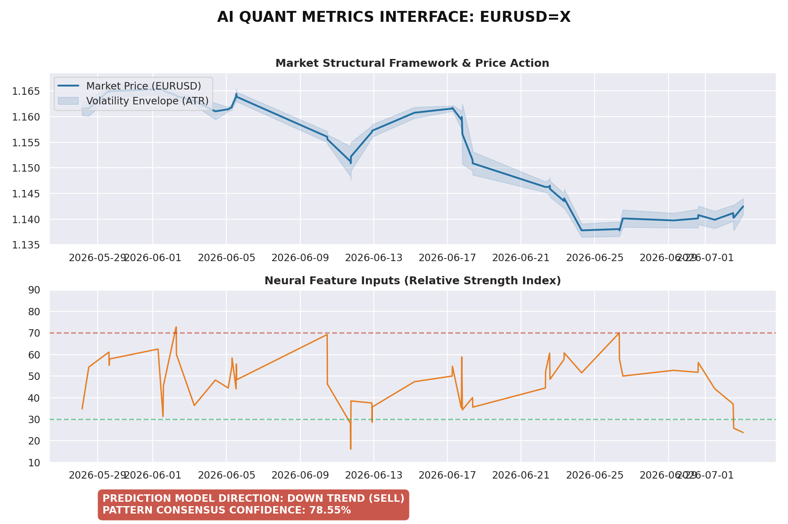

# 🤖 Autonomous ML Forex Trading Engine
An automated quantitative machine learning pipeline running serverless infrastructure. Powered by regularized gradient boosting architectures.

---

### 📊 Live Operations Dashboard
The interface below updates automatically every 30 minutes during live Forex market hours (Monday - Friday).

---

### 🕹️ How to Interact with the System
As an end-user, you can manually force the AI engine to scan the market and re-render the interface at any time:

1. Click on the **Actions** tab at the top menu bar.
2. Select **Automated ML Trading Engine** from the left-hand workspace list.
3. Click the **Run workflow** dropdown on the right side of the screen.
4. Click the green **Run workflow** action button to deploy the cloud runners.
